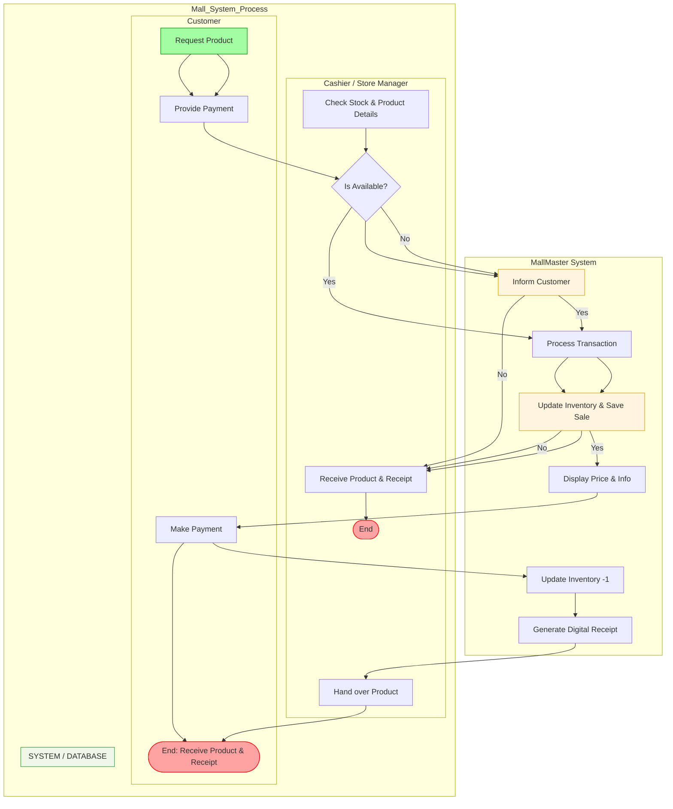

## Customer Purchase Flow Diagram

```mermaid
graph TD
    %% Roles/Lanes definition
    subgraph Customer_Lane [Customer]
        A([Start: Needs Product]) --> B[Request Product]
        L[Make Payment] --> M([End: Receive Product & Receipt])
    end

    subgraph Cashier_Lane [Cashier / Store Manager]
        B --> C[Search Product in System]
        G[Inform: Out of Stock] --> N([End])
        K[Hand over Product] --> M
    end

    subgraph System_Lane [MallMaster System]
        C --> D{Is Product Available?}
        D -- No --> G
        D -- Yes --> E[Check Product Details]
        E --> F{Is it Correct/Valid?}
        F -- No --> G
        F -- Yes --> H[Display Price & Info]
        H --> L
        L --> I[Update Inventory -1]
        I --> J[Generate Digital Receipt]
        J --> K
    end

    %% Styling
    style A fill:#a2fca2,stroke:#008000
    style N fill:#fca2a2,stroke:#ff0000
    style M fill:#fca2a2,stroke:#ff0000
    style D fill:#fff4dd,stroke:#d4a017
    style F fill:#fff4dd,stroke:#d4a017

    subgraph Mall_System_Process
        direction TB
        subgraph Customer_Lane [CUSTOMER]
            A[Request Product] --> B[Provide Payment]
            G[Receive Product & Receipt]
        end

        subgraph Cashier_Lane [CASHIER]
            B1[Check Stock & Product Details] --> C{Is Available?}
            C -- No --> D[Inform Customer]
            C -- Yes --> E[Process Transaction]
        end

        subgraph Database_Lane [SYSTEM / DATABASE]
            E --> F[Update Inventory & Save Sale]
            F --> G
        end
    end

    %% Styles
    style Customer_Lane fill:#e3f2fd,stroke:#0d47a1
    style Cashier_Lane fill:#fff9c4,stroke:#fbc02d
    style Database_Lane fill:#f1f8e9,stroke:#388e3c
```
