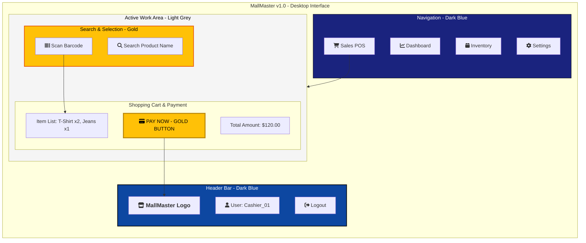

# UI/UX Design - MallMaster

```mermaid
graph TD
    %% App Structure
    subgraph Browser_Window [MallMaster v1.0 - Desktop Interface]
        direction TB
        
        subgraph Top_Navigation [Header Bar - Dark Blue]
            H1[fa:fa-store MallMaster Logo]
            H2[fa:fa-user User: Cashier_01]
            H3[fa:fa-sign-out-alt Logout]
        end

        subgraph Sidebar_Menu [Navigation - Dark Blue]
            M1[fa:fa-chart-line Dashboard]
            M2[fa:fa-box Inventory]
            M3[fa:fa-shopping-cart Sales POS]
            M4[fa:fa-cog Settings]
        end

        subgraph Main_Desktop [Active Work Area - Light Grey]
            subgraph Search_Area [Search & Selection - Gold]
                S1[fa:fa-barcode Scan Barcode]
                S2[fa:fa-search Search Product Name]
            end
            
            subgraph Cart_Area [Shopping Cart & Payment]
                C1[Item List: T-Shirt x2, Jeans x1]
                C2[Total Amount: $120.00]
                C3[fa:fa-credit-card PAY NOW - GOLD BUTTON]
            end
        end
    end

    %% Connections
    M3 --> Main_Desktop
    S1 --> C1
    C3 --> H1

    %% Styling (Dark Blue & Gold)
    style Top_Navigation fill:#0d47a1,color:#fff,stroke:#000,stroke-width:2px
    style Sidebar_Menu fill:#1a237e,color:#fff,stroke:#000
    style Search_Area fill:#ffc107,color:#000,stroke:#e65100,stroke-width:2px
    style C3 fill:#ffc107,color:#000,stroke:#b8860b,stroke-width:3px
    style Main_Desktop fill:#f5f5f5,color:#000
    style H1 font-weight:bold,font-size:18px
```
