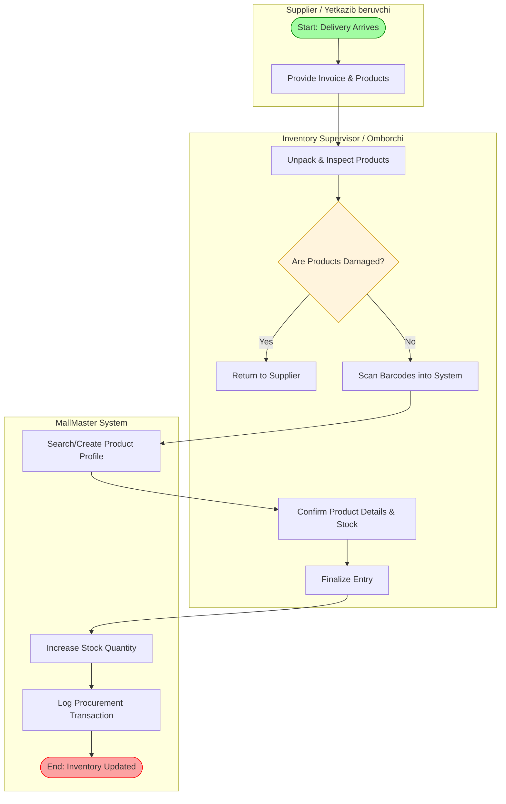
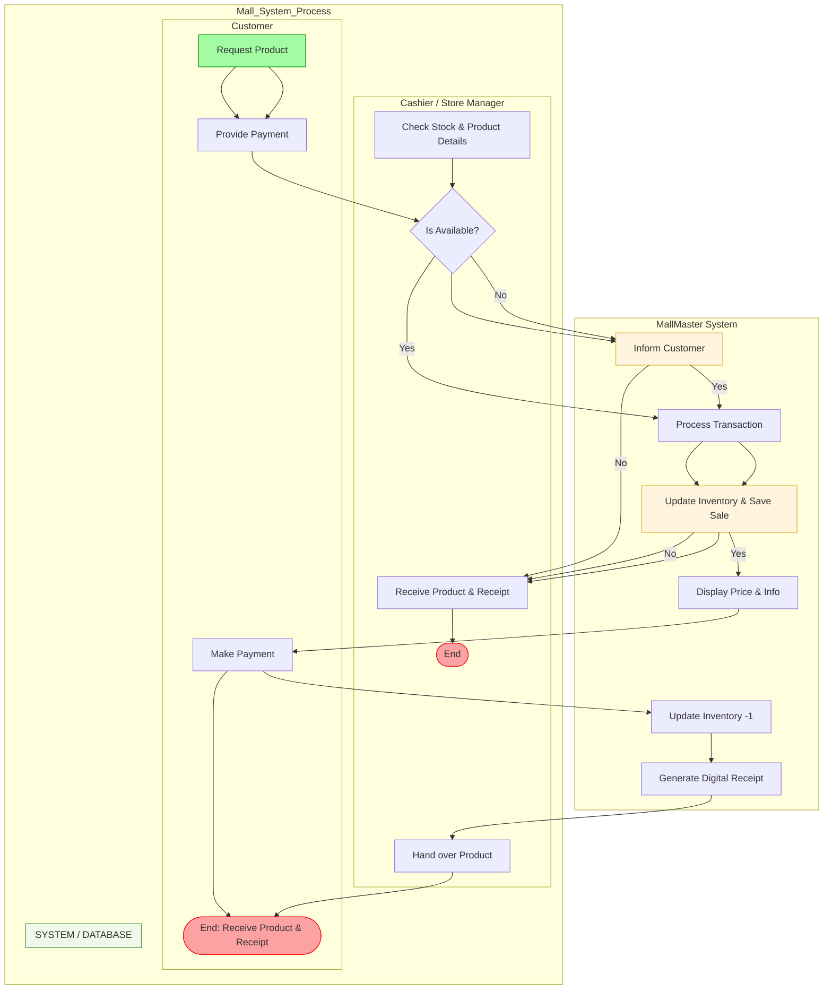

# Week 2: Business Process Modeling (BPM) - MallMaster

## 1. Goal
The objective of this week is to visualize how the shopping mall's core business processes work and how the system automates these tasks.

---

## 2. Core Process: Product Sales Flow
This process describes the interaction between the Customer, Cashier/Store Manager, and the MallMaster System during a purchase.

### Process Steps:
1. **Inquiry:** Customer requests a specific product.
2. **System Search:** Cashier searches for the product in the system.
3. **Availability Check:**
   - If **In Stock**: Proceed to checkout.
   - If **Out of Stock**: Suggest alternative products or inform the customer.
4. **Validation:** System checks the product details (e.g., correct batch or brand if needed).
5. **Transaction:** Customer pays via Cash, Card, or Digital Wallet.
6. **Auto-Update:** System decrements the stock count and logs the transaction.
7. **Receipt:** System prints/generates a digital receipt.

---

## 3. Supplier to Inventory Flow Diagram

---

## 4. Customer Purchase Flow Diagram

