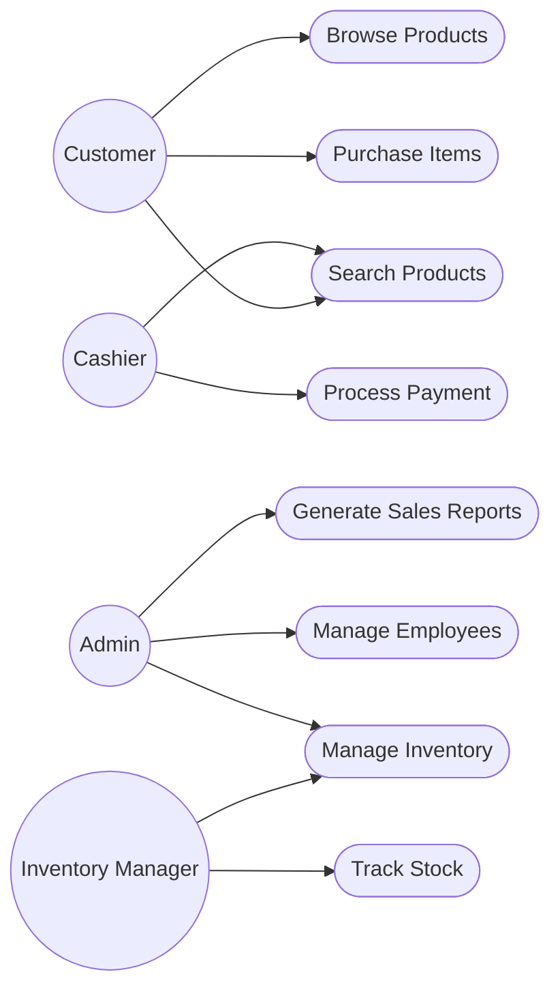

# Week 3: Use Case Diagram - PharmaFlow

## Visual Representation
Below is the Use Case diagram showing the interactions between actors and the system:

# Shopping Mall Management System

## Use Case Diagram

