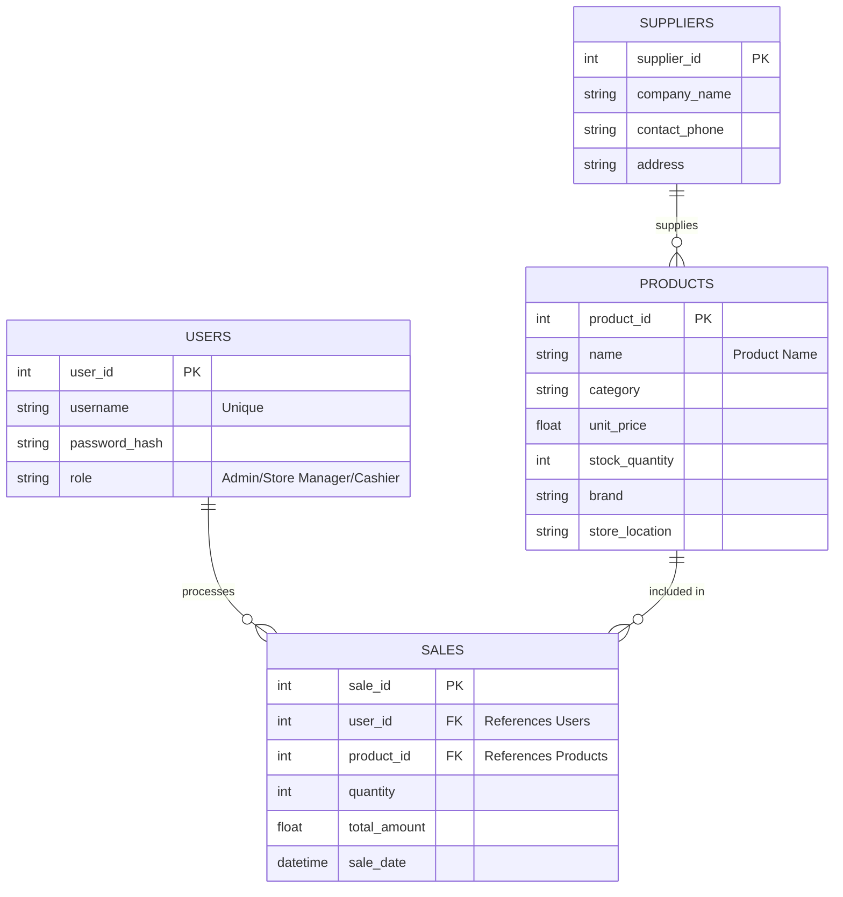

## 1. ER Diagram

# Week 4: Database Architecture - MallMaster

The **MallMaster** database is structured into three main modules, aligned with the mall business processes:

1. **User Management (Dark Blue):** Handles authentication and authorization. Records which employee (Admin / Store Manager / Cashier) is using the system.
2. **Inventory System (Gold):** Manages all products. Links each product to its supplier and tracks stock levels automatically.
3. **Transaction System (Dark Blue):** The core of the POS. Every sale is linked to a specific product and a specific user to ensure accountability.

---
```sql
CREATE TABLE Users (
    user_id SERIAL PRIMARY KEY,
    username VARCHAR(50) UNIQUE NOT NULL,
    role VARCHAR(20) CHECK (role IN ('Admin', 'Store Manager', 'Cashier'))
);

CREATE TABLE Products (
    product_id SERIAL PRIMARY KEY,
    name VARCHAR(100) NOT NULL,
    category VARCHAR(50),
    brand VARCHAR(50),
    store_location VARCHAR(50),
    unit_price DECIMAL(10, 2) NOT NULL,
    stock_quantity INT DEFAULT 0
);

CREATE TABLE Sales (
    sale_id SERIAL PRIMARY KEY,
    user_id INT REFERENCES Users(user_id),
    product_id INT REFERENCES Products(product_id),
    quantity INT NOT NULL,
    total_amount DECIMAL(10, 2),
    sale_date TIMESTAMP DEFAULT CURRENT_TIMESTAMP
);

CREATE TABLE Suppliers (
    supplier_id SERIAL PRIMARY KEY,
    company_name VARCHAR(100) NOT NULL,
    contact_phone VARCHAR(20),
    address VARCHAR(200)
);
```
